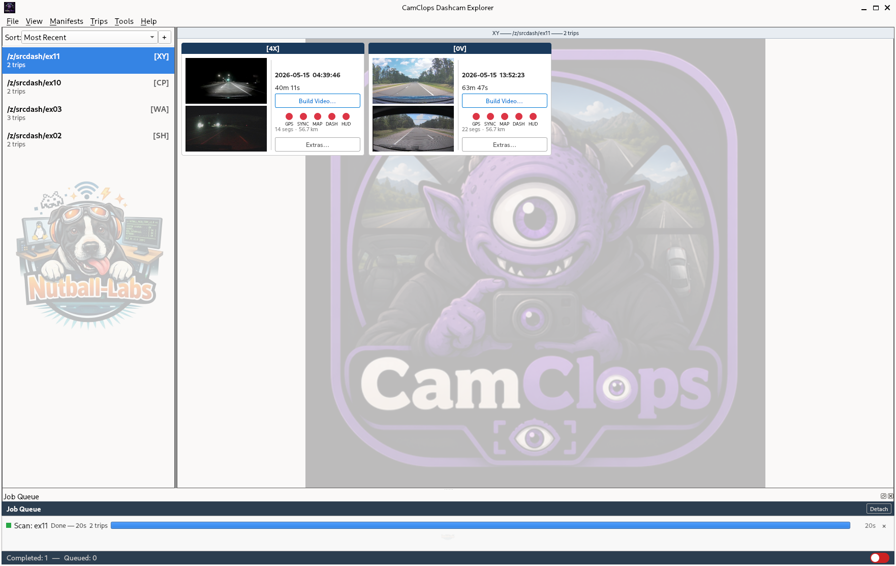
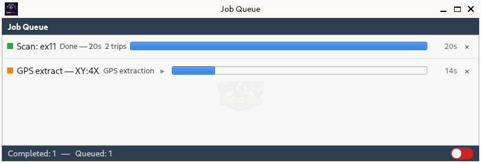
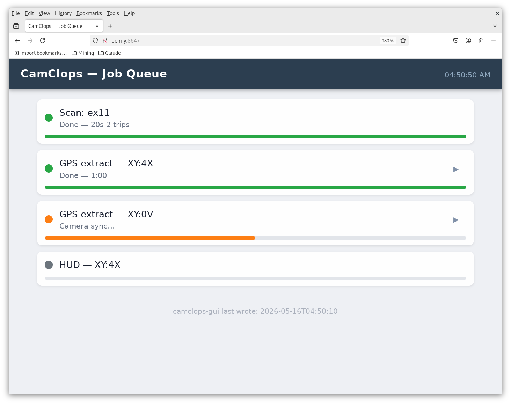

# CamClops — Screenshots

---

## Main Window

The main window with the **ex11** footage set loaded. The left panel lists
manifests; the right panel shows the trip tile grid. Each tile displays the
trip date, thumbnail, duration, and status indicators for GPS, Map, Dashboard,
and HUD outputs. The CamClops mascot watermark fills empty grid space. The
Job Queue panel is docked at the bottom with a GPS extraction in progress.

---

## Job Queue

The detached Job Queue panel. Completed jobs show a green dot and a full
progress bar; running jobs show an orange dot and a partial bar with elapsed
time. Here a manifest scan finished in 20 seconds (2 trips found) and a GPS
extraction is in progress at 14 seconds. The queue can be docked inside the
main window or floated as a standalone panel.

---

## Remote Monitor

The browser-based remote monitor (`penny:8647`) served by `clops_monitor.py`.
Any browser on the local network can watch the live job queue without needing
the desktop GUI open. This view shows four jobs: two completed GPS extractions,
a camera sync analysis in progress, and a HUD build queued behind it. The
timestamp at the bottom shows when camclops-gui last wrote the status file.

---

## Telemetry Timelapse

[Watch on YouTube](https://www.youtube.com/watch?v=4kOj_mbFeX8)

A timelapse of a single commute home with the telemetry overlay rendered
by `pm_hud.py`. Couple minor glitches in the layout that I'll work on 
fixing over the next few days.

<!-- SN: 00122 -->
